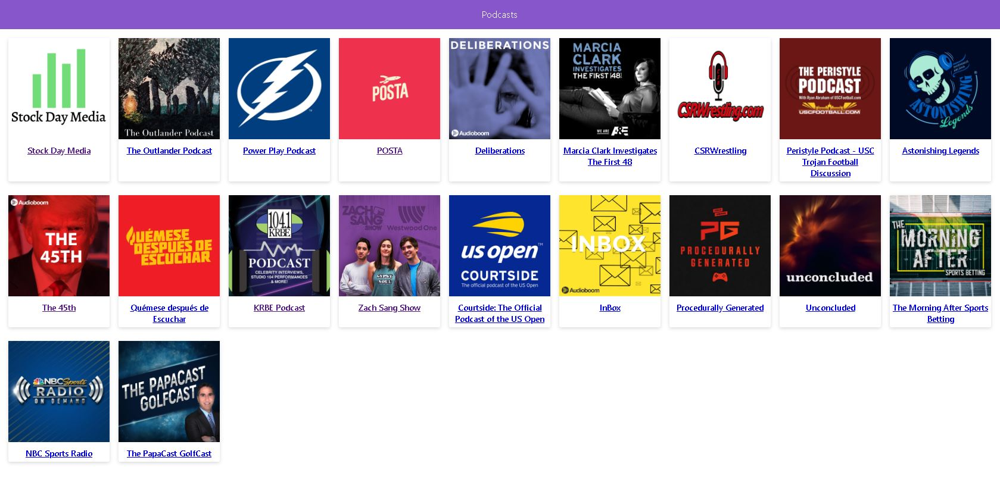

# App de Podcast de curso de Next JS

App de Podcast integrada con la API de AudioBoom para aprender NextJS

[Ver la aplicación](https://podcasts-nextjs-course.vercel.app/)

## ¿Cómo funciona?

Requiere NodeJS 10

- `yarn add` para instalar las dependencias
- `yarn dev` para el entorno de desarrollo
- `yarn build && yarn start` para el entorno de producción

## Licencia

MIT
